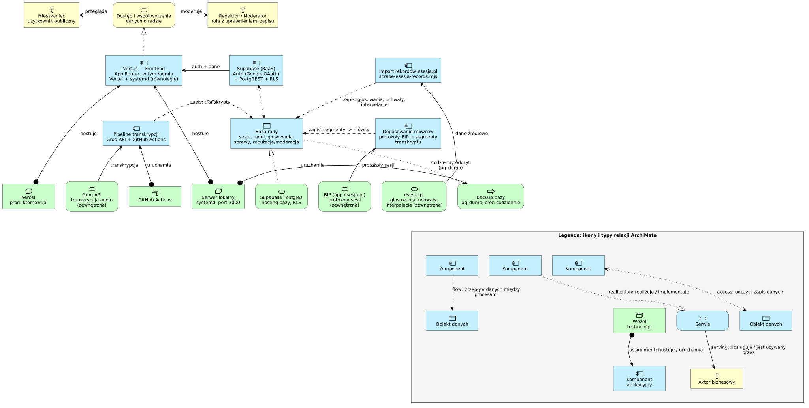

# Architektura — diagram ArchiMate

`architektura.puml` to źródłowy opis architektury systemu Rada (Agatka) w
notacji [ArchiMate](https://www.archimatetool.com/) 3.2, zapisany jako tekst
(PlantUML + biblioteka [Archimate-PlantUML](https://github.com/plantuml-stdlib/Archimate-PlantUML)).
Trzy warstwy: biznesowa, aplikacji, technologii — z prawdziwymi relacjami
ArchiMate (`serving`, `realization`, `access`, `flow`, `assignment`), nie
strzałkami-ozdobnikami.

`architektura.svg` / `architektura.png` / `architektura.pdf` to wygenerowane
z niego obrazy — wersjonowane razem ze źródłem, żeby diagram był widoczny
wprost na GitHubie bez renderowania.

`lib/` to zvendorowana biblioteka Archimate-PlantUML (wraz z jej stylami),
żeby render działał offline i nie zależał od dostępności repo na GitHubie
w momencie generowania.

## Podgląd



## Jak zmienić diagram

1. Edytuj `architektura.puml` (dodaj/zmień elementy i relacje — makra opisane
   w `lib/Archimate.puml`, pełna lista w
   [README biblioteki](https://github.com/plantuml-stdlib/Archimate-PlantUML)).
2. Wygeneruj obrazy na nowo:
   ```
   bash scripts/render-architecture.sh
   ```
   Skrypt sam pobierze `plantuml.jar` do `~/.cache/rada-mvp-tools/` przy
   pierwszym uruchomieniu (system ma za starą wersję PlantUML w PATH, więc
   render zawsze używa tej pobranej). PDF jest generowany osobno przez
   headless Chrome/Chromium z gotowego SVG (jeśli dostępny w PATH) — natywny
   eksport PlantUML do PDF gubi polskie znaki diakrytyczne niezależnie od
   ustawionego fontu, więc go nie używamy.
3. Skomituj `.puml` razem ze zaktualizowanymi `.svg`/`.png`/`.pdf`.

## Uwaga o layoucie

PlantUML/Graphviz układa elementy automatycznie na podstawie kierunku
relacji — stąd w źródle warianty `_Up`/`_Down`/`_Left`/`_Right` (np.
`Rel_Assignment_Up`), które wymuszają, żeby warstwy zostały w kolejności
biznes → aplikacja → technologia, a elementy w tym samym rzędzie (`together
{ ... }`) nie rozjeżdżały się pionowo. To nie jest kosmetyka — usunięcie
tych wariantów psuje kolejność warstw.
